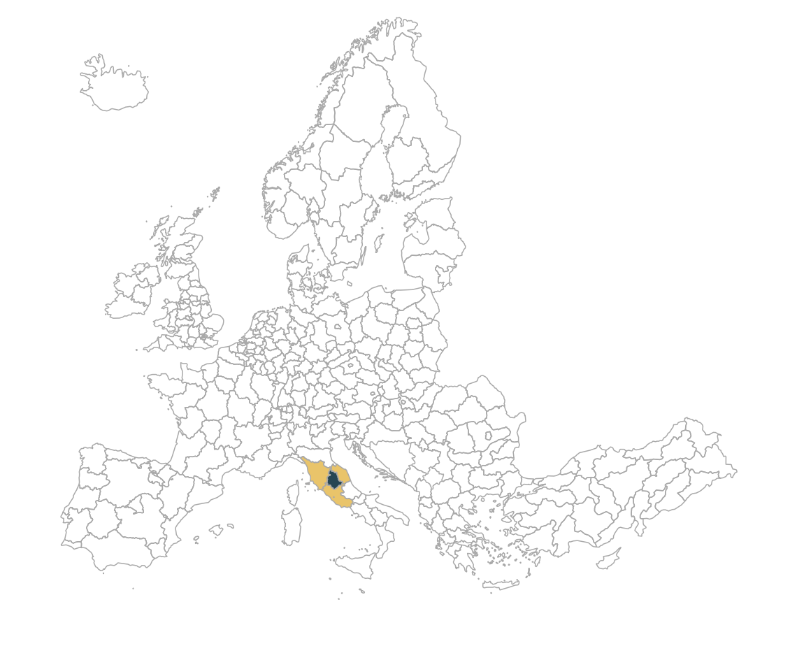

# Adjacency list creation from shapefiles

Constructing a list of neighboring regions from .shp files. 
 
Example -- adjacency list of EU NUTS2 regions 
 
shape file source: https://ec.europa.eu/eurostat/web/gisco/geodata/reference-data/administrative-units-statistical-units/nuts 
 
scripts: 
*shp_to_adjacency_list.ipynb* 
Python code to construct adjacency list of regions from the example shapefile. 
 

*map_visuals.ipynb* 
Python code to visualize an example -- se below. 
 

 
 

